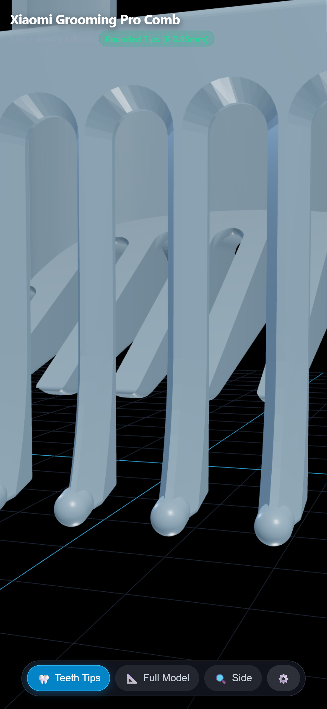
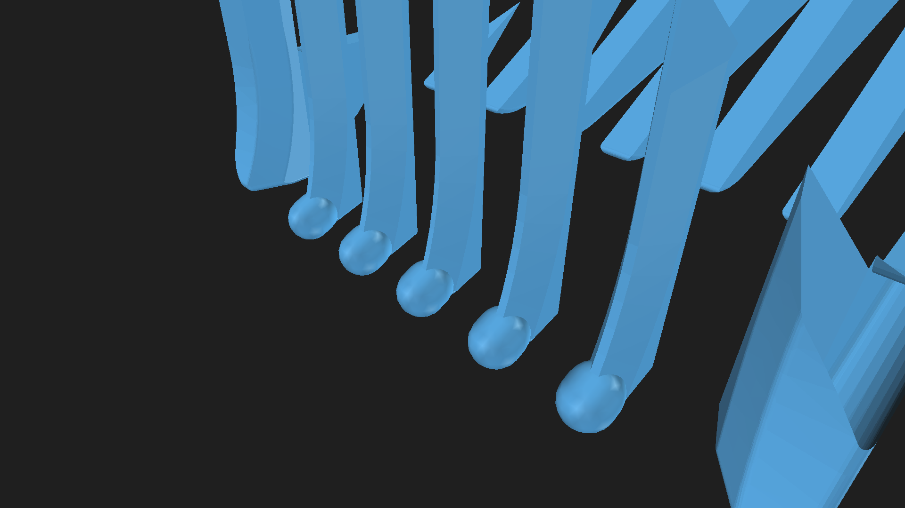
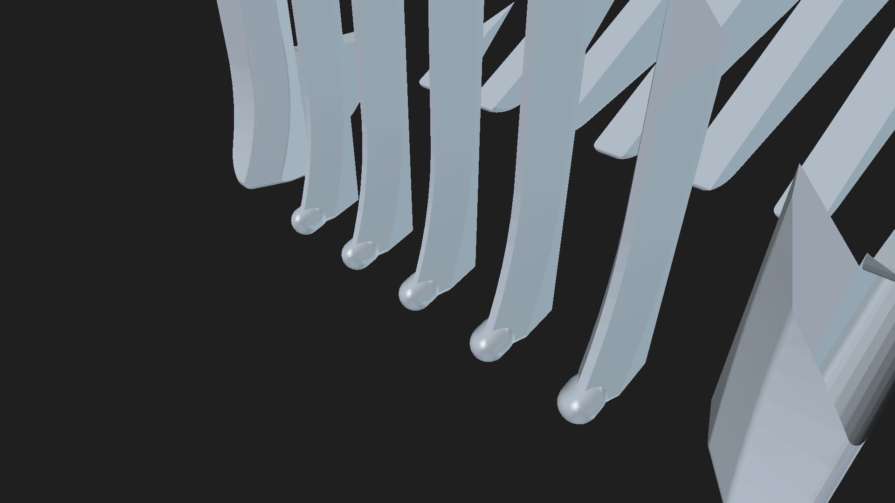

# Xiaomi Grooming Pro Comb Attachment (Skin-Friendly Editions)

An improved replacement comb attachment for the **Xiaomi Grooming Pro Trimmer / Shaver**, engineered for maximum comfort with skin-friendly rounded teeth tips.

---

## 🌐 Live Interactive 3D Viewer

Experience, compare, and inspect both design versions directly in your browser:
👉 **[Launch Live 3D Viewer](https://glotoff.github.io/xiaomi-grooming-pro-comb/)**

*Built with Three.js & WebGL. Includes instant switching between **Extra Rounded** and **Medium Rounded** versions, mobile bottom preset bar, camera presets, surface roughness/color customizer, wireframe toggle, and turntable auto-rotation.*

---

## 💡 Two Skin-Friendly Versions Available

| Version | Tip Radius | Characteristics | Best For |
| :--- | :--- | :--- | :--- |
| **Extra Rounded (Pearl Tip)** | **R ≈ 1.25 mm** | Pronounced, bulbous comfort dome; maximum glide; 0% chance of scratching even with firm pressure | Sensitive facial/neck skin, close body grooming, ultra-comfort |
| **Medium Rounded (Bullnose)** | **R ≈ 0.85 mm** | Balanced bullnose curve; smooth glide; matches standard commercial comb profile | Standard beard & hair trimming, crisp cutting edge entry |

*Both versions maintain 100% factory dimensional accuracy for the snap-fit retention prongs, side guide rails, and tooth slot spacing.*

---

## 📸 3D Renders Comparison

### Extra Rounded (R ≈ 1.25 mm)

### Medium Rounded (R ≈ 0.85 mm)

### Original Sharp Chisel Tips (Unmodified Reference)

---

## 📦 Files in this Repository

| File | Format | Description |
| :--- | :--- | :--- |
| **`Xiaomi_Grooming_Pro_Comb_Extra_Rounded.3mf`** | 3MF | **[NEW]** Extra Rounded (R 1.25mm) print file for OrcaSlicer / Bambu Studio |
| **`Xiaomi_Grooming_Pro_Comb_Extra_Rounded.stl`** | STL | **[NEW]** Extra Rounded high-resolution solid mesh (61,990 facets) |
| **`Xiaomi_Grooming_Pro_Comb_Rounded.3mf`** | 3MF | Medium Rounded (R 0.85mm) print file |
| **`Xiaomi_Grooming_Pro_Comb_Rounded.stl`** | STL | Medium Rounded high-resolution solid mesh (59,286 facets) |
| **`Xiaomi_Grooming_Pro_Comb.3mf`** | 3MF | Original factory model (unmodified reference) |
| **`freecad-Unnamed1.FCStd`** | FCStd | FreeCAD project containing all parametric B-rep Solid models |
| **`index.html`** | HTML | Interactive dual-version Three.js 3D web viewer (hosted via GitHub Pages) |

---

## 🖨️ 3D Printing Recommendations

- **Material**: PETG, PLA+, or Tough Resin (ABS-Like)
- **Layer Height**: `0.12 mm` - `0.16 mm` (enables smooth curvature on the rounded tips)
- **Walls / Perimeters**: `4` or more (for maximum rigidity of the comb teeth)
- **Infill**: `100%` (comb tines benefit from solid infill)
- **Orientation**: Upright on base or tilted back with tree supports under overhangs.
