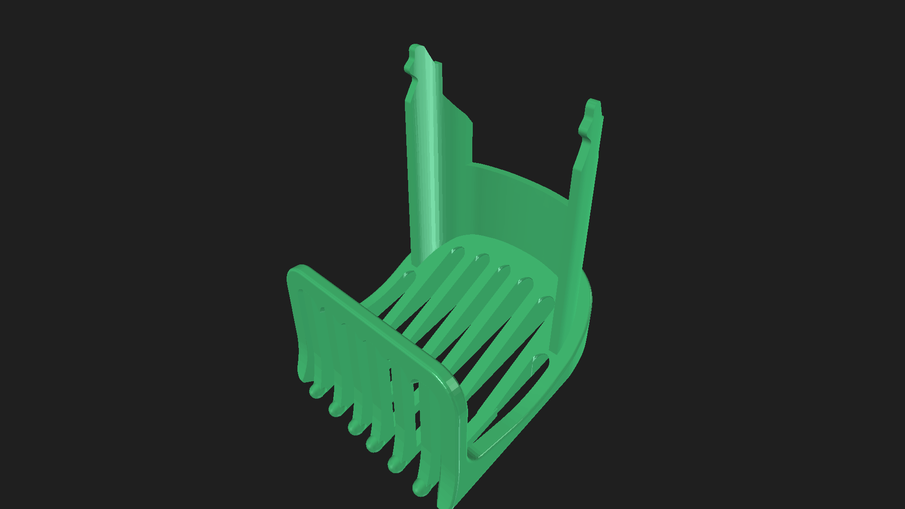
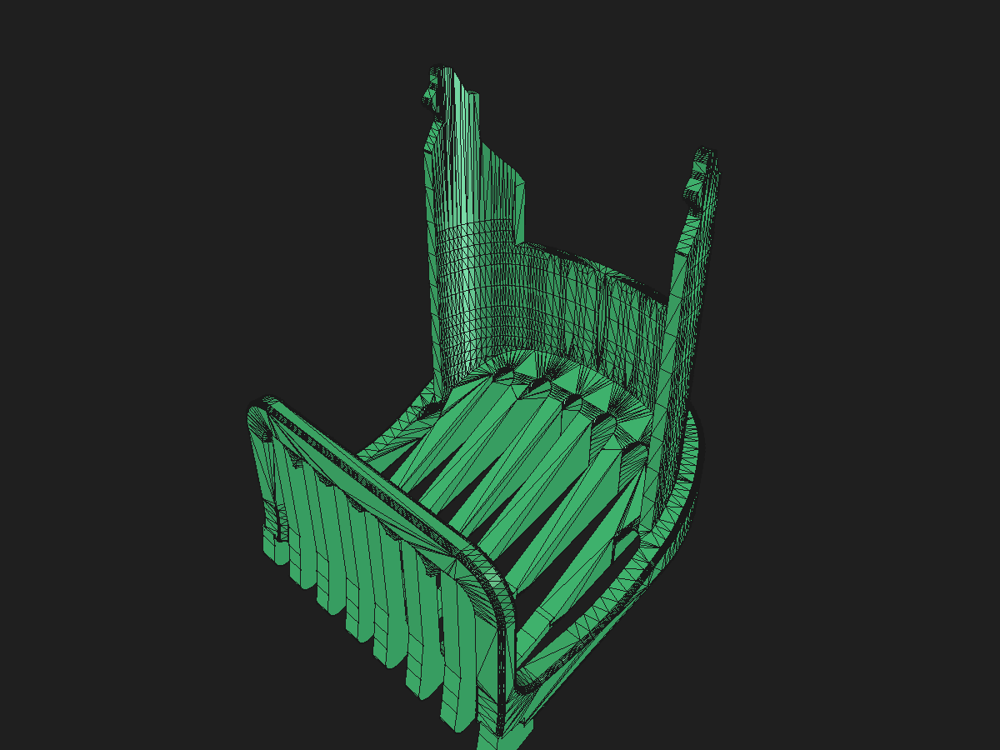
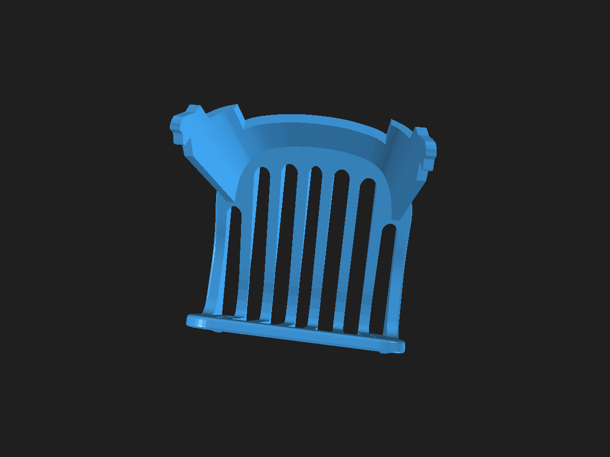
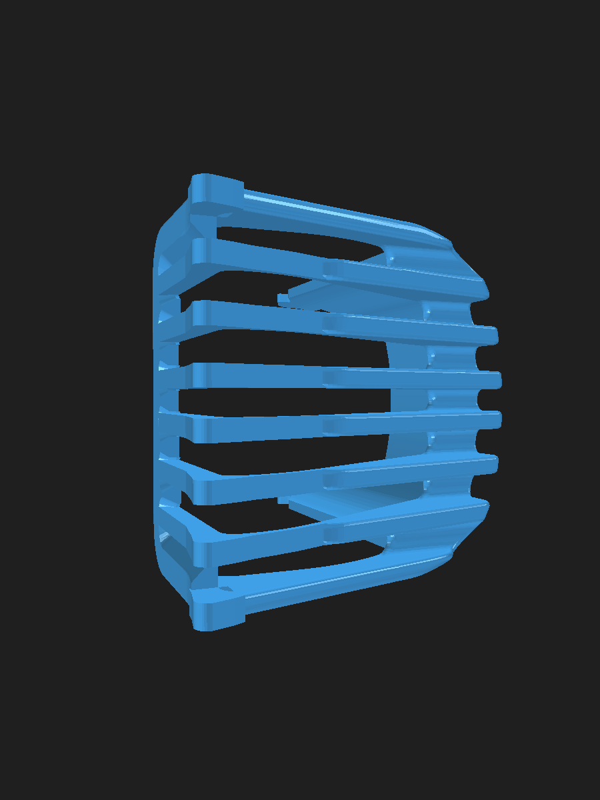
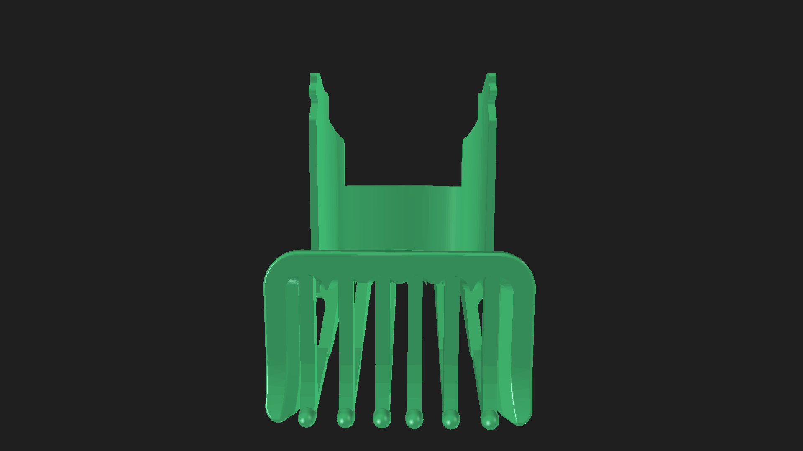
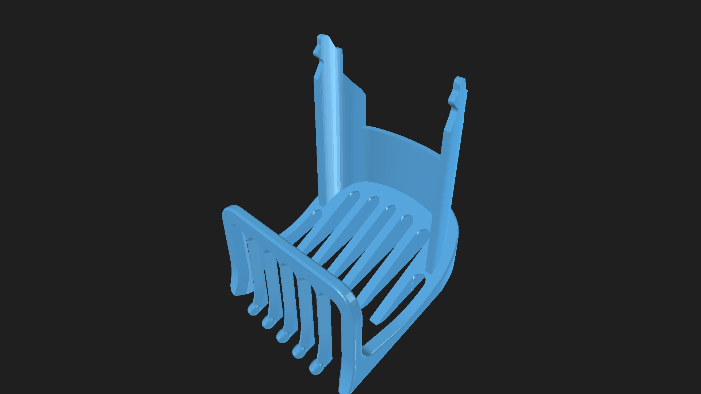

# Xiaomi Grooming Pro Comb Attachment (Skin-Friendly Editions)

An improved replacement comb attachment for the **Xiaomi Grooming Pro Trimmer / Shaver**, engineered for maximum comfort with continuous runner ribs and skin-friendly rounded teeth tips.

---

## 🌐 Live Interactive 3D Viewer

Experience, compare, and inspect all design versions directly in your browser:
👉 **[Launch Live 3D Viewer](https://glotoff.github.io/xiaomi-grooming-pro-comb/)**

*Built with Three.js & WebGL. Includes instant switching between **6-Teeth Connected**, **Extra Rounded**, and **Medium Rounded** versions, mobile bottom preset bar, camera presets, surface roughness/color customizer, wireframe toggle, and turntable auto-rotation.*

---

## 💡 Design Versions Available

| Version | Teeth Count | Rib Connection | Tip Radius | Best For |
| :--- | :--- | :--- | :--- | :--- |
| **6-Teeth Heavy-Duty (Reinforced +61% Strength)** | **6 Front Teeth** | **100% continuous connection**, thickened runner ($h = 3.30\text{ mm}$), enlarged inner fillet ($R_{\text{in}} = 2.20\text{ mm}$) | **R = 1.25 mm smooth filleted rounding** | **Maximum durability & flex resistance**. Withstands heavy pressure without bending; optimal for high-speed dense trimming. |
| **6-Teeth Connected (Standard)** | **6 Front Teeth** | **100% continuous connection** from front teeth across the base gap to all 6 rear ribs ($h = 2.60\text{ mm}$) | **R = 1.25 mm smooth filleted rounding** | **Maximum skin protection & smooth gliding**. Eliminates skin pinching; balanced lightweight design. |
| **Extra Rounded (Pearl Tip)** | 5 Front Teeth | Disconnected arch / rear bed gap | R ≈ 1.25 mm | Bulbous comfort dome, close body grooming |
| **Medium Rounded (Bullnose)** | 5 Front Teeth | Disconnected arch / rear bed gap | R ≈ 0.85 mm | Standard beard & hair trimming |

*All versions maintain 100% factory dimensional accuracy for the snap-fit retention prongs, side guide rails, and mounting slots.*

---

## 📸 3D Renders Comparison

### 6-Teeth Heavy-Duty (Reinforced +61% Strength)

### 6-Teeth Connected (Continuous Ribs + Filleted Smooth Rounding)

### Extra Rounded (5 Teeth, R ≈ 1.25 mm)

### Medium Rounded (5 Teeth, R ≈ 0.85 mm)

---

## 📦 Files in this Repository

| File | Format | Description |
| :--- | :--- | :--- |
| **`Xiaomi_Grooming_Pro_Comb_6Teeth_HeavyDuty.3mf`** | 3MF | **[HEAVY-DUTY]** Reinforced model (+61% strength) sliced & ready for OrcaSlicer |
| **`Xiaomi_Grooming_Pro_Comb_6Teeth_HeavyDuty.stl`** | STL | **[HEAVY-DUTY]** Reinforced high-precision solid mesh |
| **`Xiaomi_Grooming_Pro_Comb_6Teeth_Connected.3mf`** | 3MF | **[STANDARD]** 6-Teeth Connected model sliced & ready for OrcaSlicer / Bambu Studio |
| **`Xiaomi_Grooming_Pro_Comb_6Teeth_Connected.stl`** | STL | **[STANDARD]** 6-Teeth Connected high-precision solid mesh |
| **`Xiaomi_Grooming_Pro_Comb_Extra_Rounded.3mf`** | 3MF | Extra Rounded (5 Teeth, R 1.25mm) print file |
| **`Xiaomi_Grooming_Pro_Comb_Extra_Rounded.stl`** | STL | Extra Rounded (5 Teeth) high-resolution solid mesh (61,990 facets) |
| **`Xiaomi_Grooming_Pro_Comb_Rounded.3mf`** | 3MF | Medium Rounded (5 Teeth, R 0.85mm) print file |
| **`Xiaomi_Grooming_Pro_Comb_Rounded.stl`** | STL | Medium Rounded (5 Teeth) high-resolution solid mesh (59,286 facets) |
| **`Xiaomi_Grooming_Pro_Comb.3mf`** | 3MF | Original factory model (unmodified reference) |
| **`freecad-Unnamed1.FCStd`** | FCStd | Complete FreeCAD project with all parametric B-rep Solid models |
| **`index.html`** | HTML | Interactive 3D web viewer with 4-version switcher (hosted on GitHub Pages) |

---

## 🖨️ 3D Printing Recommendations

- **Material**: PETG, PLA+, or ABS/ASA
- **Layer Height**: `0.12 mm` - `0.16 mm` (enables smooth curvature on the rounded tips and continuous ribs)
- **Supports**: **Tree (Auto)** enabled (supports overhangs and tines cleanly with minimal contact points)
- **Walls / Perimeters**: `4` or more (for maximum tine strength)
- **Infill**: `100%` (comb tines benefit from solid infill)
- **Orientation**: Upright on plate as pre-configured in OrcaSlicer
