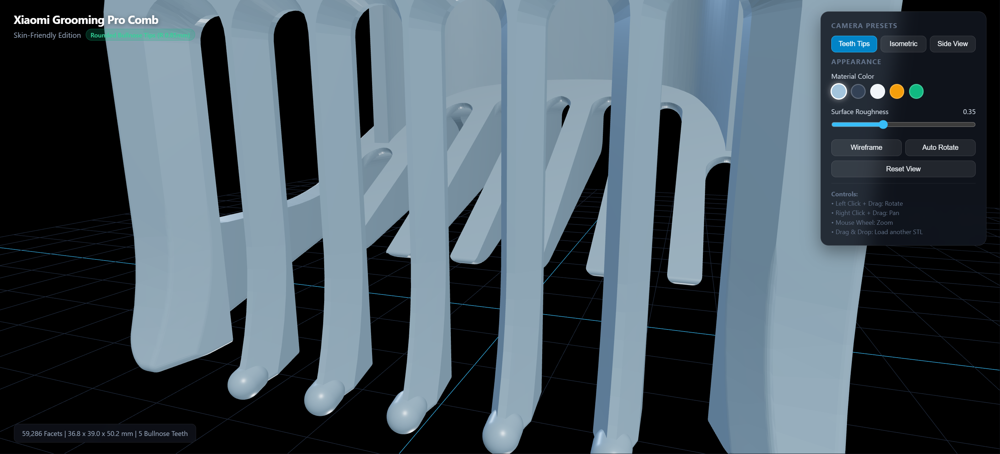
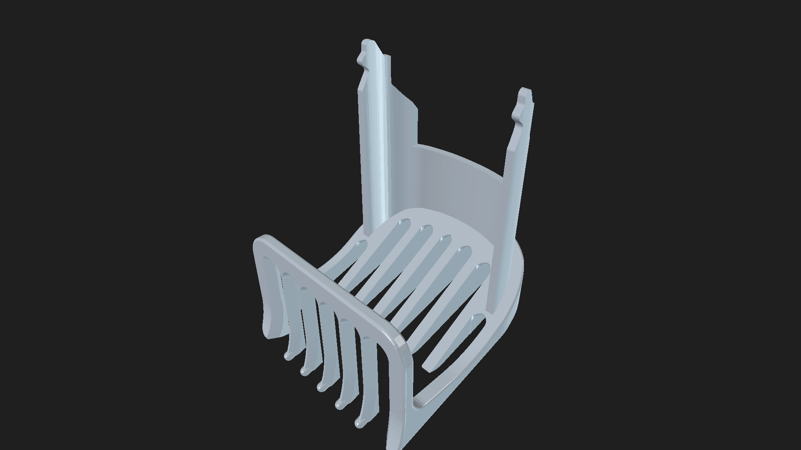

# Xiaomi Grooming Pro Comb Attachment (Skin-Friendly Edition)

An improved replacement comb attachment for the **Xiaomi Grooming Pro Trimmer / Shaver**, engineered for comfort with rounded, skin-friendly teeth tips.

---

## 🌐 Live Interactive 3D Viewer

Experience and inspect the 3D model directly in your browser:
👉 **[Launch Live 3D Viewer](https://glotoff.github.io/xiaomi-grooming-pro-comb/)**

*Built with Three.js & WebGL. Includes orbit controls, camera presets, surface roughness/color customizer, wireframe toggle, and turntable auto-rotation.*

---

## 💡 The Problem & The Solution

- **The Problem**: The original 3D model had comb teeth that terminated in flat, sharp-edged chisels (0.67 mm x 0.47 mm) with 90° perimeter corners. When dragged across facial or neck skin at trimming angles, these sharp points catch and cause skin irritation.
- **The Solution**: All 5 comb teeth tips have been reshaped with continuous, smooth bullnose domes (R ≈ 0.85 mm). The teeth now glide effortlessly across the skin without scratching.
- **Dimensional Fidelity**: All functional retention snap clips, guide rails, and comb slot spacings remain 100% true to the original factory specifications.

---

## 📸 3D Renders

### Close-up: Rounded Bullnose Tips

### Full Model Overview

---

## 📦 Files in this Repository

| File | Format | Description |
| :--- | :--- | :--- |
| **`Xiaomi_Grooming_Pro_Comb_Rounded.3mf`** | 3MF | Recommended print file with full mesh data (OrcaSlicer / Bambu Studio / PrusaSlicer) |
| **`Xiaomi_Grooming_Pro_Comb_Rounded.stl`** | STL | High-resolution watertight solid mesh (59,286 facets) |
| **`Xiaomi_Grooming_Pro_Comb.3mf`** | 3MF | Original unmodified comb model for reference |
| **`freecad-Unnamed1.FCStd`** | FCStd | FreeCAD project containing the parametric B-rep Solid source |
| **`index.html`** | HTML | Self-contained Three.js interactive 3D web viewer (hosted via GitHub Pages) |

---

## 🖨️ 3D Printing Recommendations

- **Material**: PETG, PLA+, or Tough Resin (ABS-Like)
- **Layer Height**: `0.12 mm` - `0.16 mm` (enables smooth curvature on the rounded tips)
- **Walls / Perimeters**: `4` or more (for maximum rigidity of the comb teeth)
- **Infill**: `100%` (comb tines benefit from solid infill)
- **Orientation**: Upright on base or tilted back with tree supports under overhangs.
